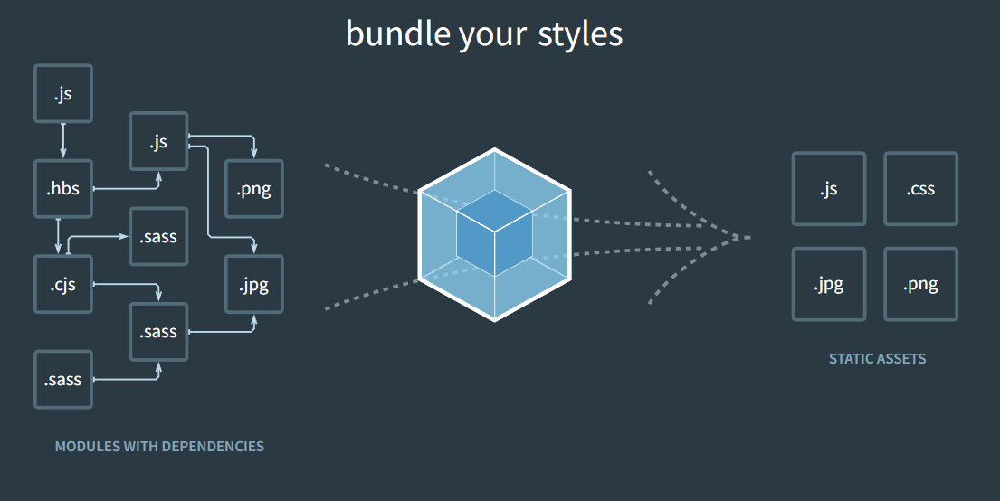

# Webpack tuts 

# Lesson 1
## A. what is webpack?



### singkat cerita webpack adalah module bundler
apa sih module bundler? singkat cerita coba deh bayangin lu install lodash tapi ga pake next js atau react. pure di html dan css biasa, gimana caranya?

pas jaman sebelum ada webpack atau module bundler lainnya yaitu jaman jaman jquery dan js vanilla. ya tentu saja di copy file source code nya taruh di assets dan jalanin pake tag di file html seperti ini kan?
```html
<script src="path/to/lodash.js"> </script>
```
salah satu drawback dari jaman dulu adalah, gimana kalo module passport buat login pake gmail ternyata dependent dengan module axios dan module axios dependent ke fetch dan begitu pula dengan module lain? sampai lu copy dan import berkali kali dan projek lu ga dibayar bayar karena lu ngerjain berbulan bulan buat import salah satu module ajah

well jaman sudah berganti di tahun 2012 an, webpack pun release dan memudahkan kita untuk memakai module module third party, selain itu juga memudahkan kita untuk mengatur keseleruhan source code. well benefit nya to be precise adalah sebagai berikut :

- Module bundling — Webpack bundles all the modules required by an application into a single file or a few files depending on the configuration.
- Code splitting — Webpack can split code into smaller chunks and load them on demand, reducing the initial load time of an application.
- Loaders — Webpack can transform files such as CSS, images, and fonts into modules that can be included in the bundle.
- Plugins — Webpack has a wide range of plugins that can be used to optimize code, generate assets, and customize the build process.

sekarang pertanyaan gw sama, gimana caranya kalo mau pake lodash tapi setelah ada webpack di halaman yang pake html dan css doang no react no next js no vite dll?

1. ya tentu saja install aja pake npm
2. npm init
3. npm install lodash
4. npm install --save-dev webpack webpack-cli kalo leled coba npm i -g webpack lalu npm i webpack-cli

lalu di package.json nya, di bagian script tinggal tambah build seperti ini:
```json
...
"scripts": {
    "build" : "webpack"
},
...
```
5. bikin public/index.html, dan src/index.js, intinya import si src/index.js di public/index.html dan coba jalanin console.log atau apa disana. terus coba import lodash si src/index.js nya terus jalanin, pasti error tapi step selanjutnya bakalan ngefix itu
6. jalanin dah
```shell
npm run build
```
7. di index.html nya arahin ke dist/main.js yang baru aja di create sama si webpack. akses lagi tuh html dan boom lodash works
8. selamat you already learn how to use webpack the really basic stuff tho


# Lesson 2
